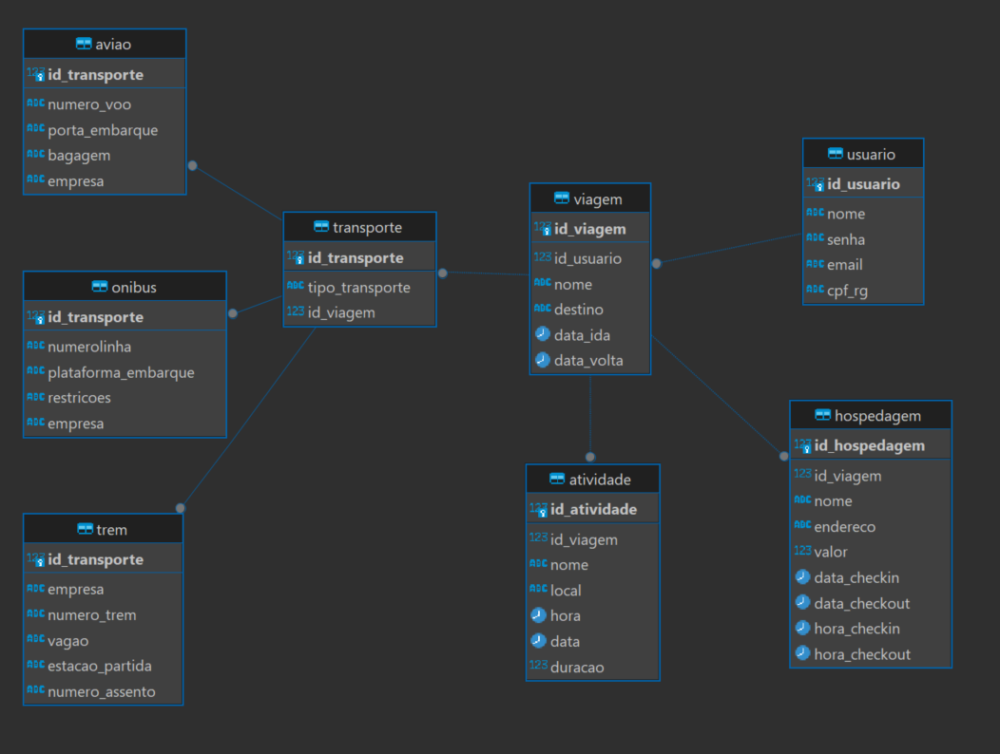

# journeyMosaic

journeyMosaic is a software that offers the ability to plan a trip. The software is entirely user-driven, where the user inputs their own data and activities. The software serves to display the organized data and remind the user of their activities.

## Prerequisites

Before you begin, ensure you have met the following requirements:

* You have installed the latest version of [Docker Desktop for Windows](https://www.docker.com/products/docker-desktop).

## Installation

To install journeyMosaic, follow these steps:

1. Clone the project repository to your local machine:

    ```bash
    git clone https://github.com/diisilva/journeyMosaic.git
    ```

2. Navigate to the project directory:

    ```bash
    cd journeyMosaic
    ```

3. Use Docker Compose to build and run the containers:

    ```bash
    docker-compose -f docker-compose.yml up --build -d
    ```

    This command will start all the services defined in your `docker-compose.yml` file in detached mode.

## Connecting to the Database

**This database is already online, hosted on an EC2 instance within AWS, and it is possible to connect to it using the credentials available in settings/config.txt.**
To connect to the database using DBeaver:

1. Open DBeaver.
2. Click on "New Database Connection".
3. Choose PostgreSQL as the database type.
4. Fill in the connection settings with the following details:
    - Host: read settings/config.txt
    - Port: `read settings/config.txt
    - Database: read settings/config.txt
    - Username: read settings/config.txt
    - Password: read settings/config.txt
5. Click on "Test Connection" to ensure everything is set up correctly.

6.  Entity-Relationship Diagram.

    

## Contributing to journeyMosaic

To contribute to journeyMosaic, follow these steps:

1. Fork this repository.
2. Create a branch: `git checkout -b MinhaNovaBrach (name your new branch)`.
3. Make your changes and commit them: `git commit -m '<commit_message>'`
4. Push to the original branch: `git push --set-upstream origin MinhaNovaBrach`;
5. Create the pull request.

Alternatively, see the GitHub documentation on [creating a pull request](https://docs.github.com/en/github/collaborating-with-issues-and-pull-requests/creating-a-pull-request).

## Contact

If you want to contact me you can reach me at `<your_email>`.

## License

This project uses the following license: [<license_name>](<link_to_license>).
